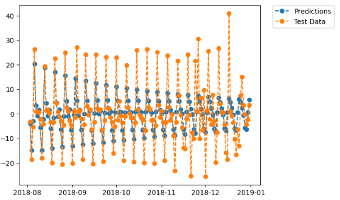

# Bike Rides in San Francisco 🚴‍♂️📈

**Case Study**: Analyzing & Forecasting the number of bike rides in San Francisco  
**Objective** : The goal is to dive deep into time-series signals, analyze it and determine the best predictive model.

**The case study is divided into two parts:**

* **Part A:** Use time-series data of the number of bike rides in San Francisco and analyze it to better understand it and choose one of the statistical models to predict future values.  
* **Part B:** Prepare the same data and structure it in order to train an RNN to predict the number of bike rides for the next 7 days.

**Motivation:** This project marks my initial exploration into time series analysis and forecasting. It serves as a crucial learning opportunity to grasp the foundational concepts and techniques essential for tackling time series problems. Additionally, it holds significant importance in building my expertise in this domain.

Data Acquisition

**Data Source**: The data was provided by ZAKA. 

You can access the data from the following link :data

## **Tech Stack & Tools**

🔹 **Python**: Utilized libraries such as **Pandas, NumPy, Matplotlib, and Seaborn** for data manipulation and visualization.

🔹 **Statsmodels**: Applied for **statistical modeling** (ARIMA, SARIMA, SARIMAX), generating **ACF and PACF plots**, and conducting **ADF test** and **Ljung-Box test** for stationarity and residual analysis.

🔹 **Scikit-learn**: Used for computing **evaluation metrics** to assess model performance.

## Key Deliverables

### **Part A: Exploratory Analysis ,Time Series Decomposition, and Statistical Modeling**

1. **Data Preprocessing**  
   * Load and clean the dataset (handle missing values, remove duplicates, etc.).  
   * Ensure the dataset is in a time series format (e.g., datetime index).  
   * Resample the data if necessary (e.g., convert to daily or hourly frequency).  
2. **Exploratory Data Analysis (EDA)**  
   * Visualize the time series data (e.g., line plots, rolling statistics).  
3. **Time Series Decomposition**  
   * Decompose the time series into its components:  
     * **Trend**: Long-term movement in the data.  
     * **Seasonality**: Repeating patterns or cycles.  
     * **Residuals**: Random noise or irregularities.  
   * Use tools like `seasonal_decompose` (from `statsmodels`) or STL decomposition.  
   * Visualize the decomposed components to understand their behavior.  
4. **Stationarity Analysis**  
   * Perform statistical tests (e.g., Augmented Dickey-Fuller test) to check for stationarity.  
   * If the data is non-stationary, apply transformations (e.g., differencing, log transformation).  
5. **Autocorrelation and Partial Autocorrelation Analysis**  
   * Plot the **Autocorrelation Function (ACF)** and **Partial Autocorrelation Function (PACF)**.  
   * Interpret the plots to identify:  
     * Significant lags for modeling (e.g., ARIMA parameters).  
     * Seasonality patterns (e.g., spikes at specific intervals).  
6.  **Baseline Models**  
   * Implement simple baseline models to establish a performance benchmark:  
     * **Moving Average**: Predict using the average of the last *n* observations.

   **7\. Statistical Model Selection**

   * Based on the analysis from Part A, select appropriate statistical models:  
     * **ARIMA (AutoRegressive Integrated Moving Average)**: For stationary data.  
     * **SARIMA (Seasonal ARIMA)**: For data with seasonality.

## Data Description: 

* date: YYYY-MM-DD   
* bike\_numbers: refer to number of bikes in that date

Features: 

* bike\_numbers

After the date is set as an index

- Dataset has 552 rows (observations) and 1 column

## Exploratory Data Analysis

  
Based on the above plot, the number of bike rides is **maximum** during **July** and **October 2018** and **minimum** during **January 2018**.

## Time Series Decomposition Analysis

  

* The **trend** component in the data is not stable and does not evolve in a consistent manner. Specifically, the trend component exhibits an upward movement over time, peaking around **mid-to-late 2018**, followed by a decline beginning in **November 2018**. This pattern suggests that bike usage could be influenced by external factors, such as seasonal weather conditions or other environmental variables.  
* In the **seasonality** component, we observe repeated patterns on a **weekly** basis. The frequent repetitions suggest a shorter periodicity than monthly indicating a seasonal effect tied to weekly cycles.  
* In the **residual** component, noise and short-term fluctuations are not systematic and unpredictable.

## Stationarity Analysis

Performed Statistical tests like:

#### **Ljung-Box Test Results** (Performed after observing ACF and PACF plots)**:**

* This test evaluates whether the residuals exhibit randomness.  
* Since the p-value is **less than 0.05**, we **reject the null hypothesis**, indicating that the data is not purely random.  
* The significant autocorrelation at selected lags (7,14,21) suggests the presence of structure in the data, which must be accounted for in modeling.

#### **Augmented Dickey-Fuller (ADF) Test Results** (Performed after observing ACF and PACF plots)**:**

* This test helps in determining whether time series is stationary or not.  
* Since the p-value is **greater than 0.05**, we **failed to reject the null hypothesis**, indicating the time series is **non-stationary.**

#### **Another way to assess stationarity:**

* The dataset was divided into **two partitions**. The **mean** and **variance** were calculated for each partition. The results showed that **mean1** (**3006.913043**) differed from **mean2** (**5628.670290**), and **variance1** (**1482065.054229**) differed from **variance2** (**3639977.719987**). These differences in mean and variance across the partitions suggest that the **time series is not stationary**.

#### **To make time series stationary:**

* Applied **differencing**  
* Another way is applying **Square Root Transformations** and then **differencing.**

**Time series data plot (after applying differencing)**

  

**Time series data plot (after applying Logarithmic transformation** and then **differencing.)**  
  

## Autocorrelation and Partial Autocorrelation Analysis

**ACF Plots:**  
  

The ACF plots reveal strong evidence of **seasonality** in the time series. This is supported by the presence of a **sinusoidal pattern** across multiple lags and the observation of significant spikes at regular intervals (lags 7, 14, 21, etc.), suggesting a weekly seasonal cycle. Furthermore, the autocorrelation values remain significantly above the confidence threshold for numerous lags, indicating a **strong autocorrelation structure** within the time series.

**Note**: Since the time series exhibits weekly seasonality, I used 25 lags to cover 25 days, 30 lags to represent a month, and 45 lags to cover 45 days (a month and 15 days). These values were chosen to analyze the data from a broader perspective. Additionally, 14 lags can be used to cover two seasonal cycles. Therefore, the selection of lags was guided by the observed seasonality patterns.

**PACF plot**  
  
 

Based on the above PACF plot,

* The **first lag** has a **strong positive correlation**, indicating that the previous time step is a good predictor of the current value.  
* The presence of **several significant lags** suggests a **higher-order AR process**.  
* After around **lag 10**, the correlations drop within the confidence interval, implying that the direct influence weakens beyond this point.  
* The presence of **negative values** at some lags suggests possible **oscillations** in the data.

ACF and PACF Plots after Applying Differencing to the original dataset:![]  

  

**ACF and PACF Plots after Applying Square Root Transformation  applying Differencing to the original dataset:**  
  

 
## Baseline Models

Applied **simple moving average filter** with **window size** of **20\.**   
  
 
The above plot shows the time series data after applying the simple moving average filter which resulted in smoothening the time series.

  
The plot above shows the original time series data alongside the time series after applying the simple moving average filter. There is a noticeable difference between the plotted original data and the averaged data ( the resulted data of sma).

To better see the effect of Simple moving average filter:

Divided the dataset into training and testing sets.

- **First 400** days to be for **training set**.  
- **552 \- 400 days** to be for the **testing set**.

Applied a **simple moving average** to the whole dataset with **window size** of **2**.  

  
The above plot shows the training and testing sets along with the **Simple Moving Average (SMA) forecast** applied to the dataset. The SMA method effectively smooths the data, reducing short-term fluctuations and capturing the general trend. However, due to its lagging nature, it may struggle to accurately predict sharp changes or seasonal variations in the data.

#### SMA Models  Evaluations

* The dataset with an SMA window size of 2 has an RMSE of 855.730.  
* The dataset with an SMA window size of 20 has an RMSE of 1804.657.

Based on the RMSE metric, the moving average with a window size of 2 provides better predictions than the one with a window size of 20, as it has a lower RMSE.

Statistical Model Selection

Tried several models for testing:

- **AR** Model of order(**20**): order of the model is chosen based on **PACF** plot.  
  - Model Evaluation: **RMSE**: **8.757**  
  - Visualizing test **actual** values against **AR** Model(**20**) **predictions**

 
Based on the above plot, there is a significant gap between actual values and the predicted values.

- **MA** model of order(**7**):  order of the model is chosen based on **ACF** plot.  
  - Model Evaluation: **RMSE**: **12.573**

              

Based on the RMSE and the above plot, I deduced that moving average model is not the right approach for this time series data.

- **SARIMAX**model representing **ARMA** model of order(**20,0,7**): chosen based on **AR** and **MA** order.  
  - Model Evaluation: **RMSE**: **8.239**  
  - Visualizing test **actual** values against **ARMA** Model(**20,0,7**) **predictions**

   

 

- **SARIMAX** model with 2 options :   
  - If it is **not seasonal** then order of (**1,1,2**)  
  - If it is seasonal then order of  (20,1,1,7) which refers to **p=20** (**AR**) , **d= 1** (**differencing**), **q=1** (**MA**), and **s=7** **seasonal** suspecting a **weekly seasonality.** 

- Model Evaluation: **RMSE**: **7.418**
- Visualizing test **actual** values against **predictions**:
     

  

- **SARIMAX** of order(**20,2,7**) **p=20** (**AR**), **d= 2** which is **differencing** by **2** and **q=7** (MA)   
- Model evaluation **RMSE**: **8.463**  
- Visualizing test **actual** values against **predictions.**  
     
    
    
- **SARIMAX** model with 2 options :   
  - If it is **not seasonal** then order of (**1,1,2**)  
  - If it is seasonal then order of  (**2,1,2,7**) which refers to **p=2** (**AR**) , **d= 1** (**differencing**), **q=2** (**MA**), and **s=7** **seasonal, suspecting** a **weekly seasonality.** 

- Model Evaluation: **RMSE :7.067**  
- Visualizing test **actual** values against **predictions.**

     

 It is evident in the above plot that the residuals and the gaps decreased between some actual values and predicted values.

## Results & Findings

 I tried all statistical models yet none of these models was good at simulating the behavior of this dataset.This may be caused by several reasons:

* Data may be not having a certain pattern that can be simulated with some statistical model

The least **RMSE** is **7.067 of order** (**2,1,2,7**) for the  **seasonal and nonseasonal order  (1,1,2)**.

## Key Terms and Definitions:

For Time series analysis, we **decompose** the time series into several components:

1. **Trend**  
2. **Seasonality**  
3. **Residual** (also known as **noise** or **irregularity**)  
     
1. **Trend** is a long-term movement or direction of the data over an extended period; it is observed on the long run, and it is an irregular event. It can be upward, downward, or stable indicating whether the series is growing, declining, or remaining consistent over time.   
2. **Seasonality**: Recurring patterns in the time series that occur at regular intervals (such as daily, monthly, or yearly).It is fixed and repeatable over the same period. It is tied to calendar-based events or cycles.  
3. **Cyclic Component**: are long-term oscillations that are not tied to a fixed calendar schedule but follow a wave-like pattern. Unlike seasonality, cyclic component is irregular and not calendar-dependent.  
4. **Cycle**: the cyclic component is not exactly the same as a **cycle.**  
5. **Stationarity**: means that the statistical properties of the data—such as mean, variance, and autocorrelation—remain constant over time.  
6. **ARIMAX** is an **ARIMA model** that includes **exogenous (X) variables**;It is used when your time series depends **not only on past values** but also on **external factors.**  
7. **SARIMAX** is a more generalized version of ARIMAX**;**it includes **seasonality** (**P, D, Q, m**), making it more powerful for seasonal data.  
8. **Augmented Dickey-Fuller (ADF) Test**: Checks for the presence of a unit root, helping to determine whether differencing is needed to make the series stationary.  
     
9. The **Ljung-Box test** examines whether residuals are **random** or exhibit **autocorrelation** at different lags.  
   1. If there is autocorrelation, it means the model hasn’t fully captured all patterns in the data, and further adjustments (ex., adding AR terms in ARIMA) may be needed.  
   2. To make your model **capture all patterns** in the data, you need to adjust it based on the **residual analysis** and **time series characteristics**.  
      1. **Ensure Stationarity:** If your time series is non-stationary:  
         1. **Apply transformations (e.g., log transformation, square root, or Box-Cox transformation).**  
         2. **Differencing (first or second order) to remove trends.**  
         3. **📌 *Check stationarity again using ADF and Ljung-Box tests.***  
              
      2. **Tune ARIMA/SARIMA Parameters**  
         1. If your **residuals** still **show patterns:**  
            1. Use **ACF & PACF plots** to refine **AR** and **MA terms:**  
               * **ACF** helps identify **MA(q) terms.**  
               * **PACF** helps identify **AR(p) terms.**  
               * **Grid Search for Best (p, d, q) values** in ex: **ARIMA.**  
               * For **seasonal data,** use **SARIMA**  
         2. **📌  *Try different (p, d, q) values and evaluate performance using AIC/BIC.***

        ***iii.***  **Model Diagnostics** (Check **Residuals** Again)

         ***After tuning the model:***

* ***Plot residuals →** Should resemble **white noise (no patterns).***  
* ***Perform Ljung-Box test → Residuals should not be autocorrelated.***  
* ***Histogram & QQ plot → Residuals should be normally distributed.***

  ***📌 If residuals still show structure, adjust ARIMA parameters or try alternative models.***

      

**Notes 📝:**  

* A **stationary time series** **does not have trends**, **seasonality**, or **changing variances**, making it easier to model and forecast.  
* **Square Root Transformation** is applied to stabilize variance.  
* **First Differencing** is applied to remove trends.  
* **Plotted ACF and PACF** after differencing to detect **AR**, **MA**, and **seasonal components.**  
* **The presence of a sinusoidal shape** in the data itself does not necessarily mean the data is non-stationary.  
* **Sinusoidal Shape: Sinusoidal patterns** represent a form of **seasonality. Seasonality** itself doesn't automatically make a **time series non-stationary.**  
  * If the **sinusoidal pattern** has a **changing amplitude or frequency over time, or if it's superimposed on a trend,** the time series would likely **be non-stationary.**  
* The appropriate **number of lags** also **depends on the frequency** of your data. If your **data is daily, 25 lags** would represent **25 days.** If your **data is hourly, 25 lags** would represent **25 hours.**  
* The **presence of negative values at some lags** suggests **possible oscillations** in the data.  
* **Use SARIMA** if the time series depends **only on its past values** and has **seasonality**.  
* **Use SARIMAX** if **external variables influence** the time series .

